# [📈 Live Status](https://chaotic-art.github.io/uptime): <!--live status--> **🟩 All systems operational**

This repository contains the open-source uptime monitor and status page for [Chaotic](https://chaotic-art.github.io/uptime), powered by [Upptime](https://github.com/upptime/upptime).

With [Upptime](https://upptime.js.org), you can get your own unlimited and free uptime monitor and status page, powered entirely by a GitHub repository. We use [Issues](https://github.com/chaotic-art/uptime/issues) as incident reports, [Actions](https://github.com/chaotic-art/uptime/actions) as uptime monitors, and [Pages](https://chaotic-art.github.io/uptime) for the status page.

<!--start: status pages-->
<!-- This summary is generated by Upptime (https://github.com/upptime/upptime) -->
<!-- Do not edit this manually, your changes will be overwritten -->
<!-- prettier-ignore -->
| URL | Status | History | Response Time | Uptime |
| --- | ------ | ------- | ------------- | ------ |
|  [Chaotic Art](https://chaotic.art) | 🟩 Up | [chaotic-art.yml](https://github.com/chaotic-art/uptime/commits/HEAD/history/chaotic-art.yml) | 

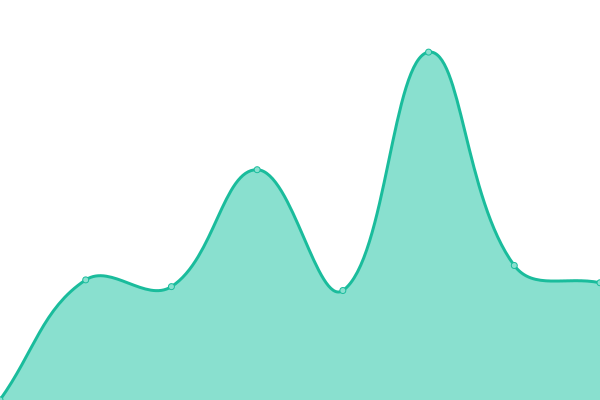 1145ms
     
 | 

<a href="https://chaotic-art.github.io/uptime/history/chaotic-art">99.40%</a>
    

|  [Price Service](https://price.chaotic.art) | 🟩 Up | [price-service.yml](https://github.com/chaotic-art/uptime/commits/HEAD/history/price-service.yml) | 

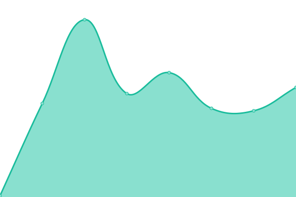 137ms
     
 | 

<a href="https://chaotic-art.github.io/uptime/history/price-service">100.00%</a>
    

|  [Genart Service](https://genart.chaotic.art) | 🟩 Up | [genart-service.yml](https://github.com/chaotic-art/uptime/commits/HEAD/history/genart-service.yml) | 

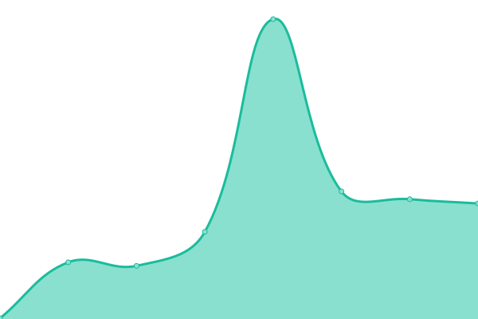 133ms
     
 | 

<a href="https://chaotic-art.github.io/uptime/history/genart-service">100.00%</a>
    

|  [Profile Service](https://profile.chaotic.art) | 🟩 Up | [profile-service.yml](https://github.com/chaotic-art/uptime/commits/HEAD/history/profile-service.yml) | 

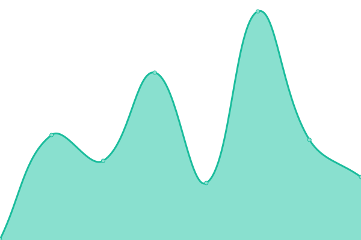 107ms
     
 | 

<a href="https://chaotic-art.github.io/uptime/history/profile-service">100.00%</a>
    

|  [Bucket Service](https://bucket.chaotic.art/) | 🟩 Up | [bucket-service.yml](https://github.com/chaotic-art/uptime/commits/HEAD/history/bucket-service.yml) | 

 124ms
     
 | 

<a href="https://chaotic-art.github.io/uptime/history/bucket-service">100.00%</a>
    

|  [Dyndata Service](https://dyndata.chaotic.art) | 🟩 Up | [dyndata-service.yml](https://github.com/chaotic-art/uptime/commits/HEAD/history/dyndata-service.yml) | 

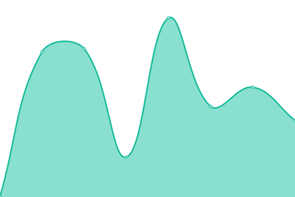 172ms
     
 | 

<a href="https://chaotic-art.github.io/uptime/history/dyndata-service">100.00%</a>
    

|  [ODA Service](https://oda.chaotic.art) | 🟩 Up | [oda-service.yml](https://github.com/chaotic-art/uptime/commits/HEAD/history/oda-service.yml) | 

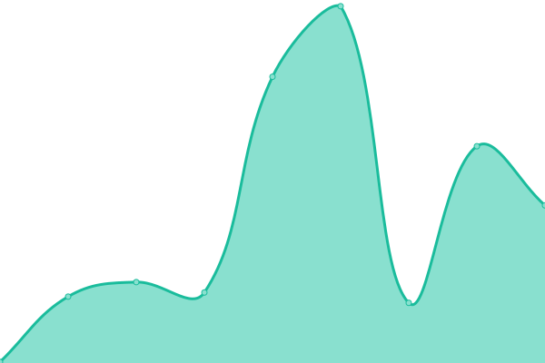 167ms
     
 | 

<a href="https://chaotic-art.github.io/uptime/history/oda-service">100.00%</a>
    

|  [Playground Bucket Service](https://playground-bucket.chaotic.art/codeChecker/04a8f6c9-07b0-40ec-88ab-e6c8789c9fe4.html?hash=0xdb736faf90adce01428200c2232bc6d9ecfb539d1d2f8451921a65c9e1cb567e) | 🟩 Up | [playground-bucket-service.yml](https://github.com/chaotic-art/uptime/commits/HEAD/history/playground-bucket-service.yml) | 

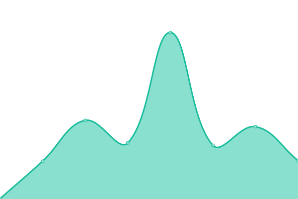 208ms
     
 | 

<a href="https://chaotic-art.github.io/uptime/history/playground-bucket-service">85.45%</a>
    

|  [NFT Storage (IPOS)](https://ipos.chaotic.art) | 🟩 Up | [nft-storage-ipos.yml](https://github.com/chaotic-art/uptime/commits/HEAD/history/nft-storage-ipos.yml) | 

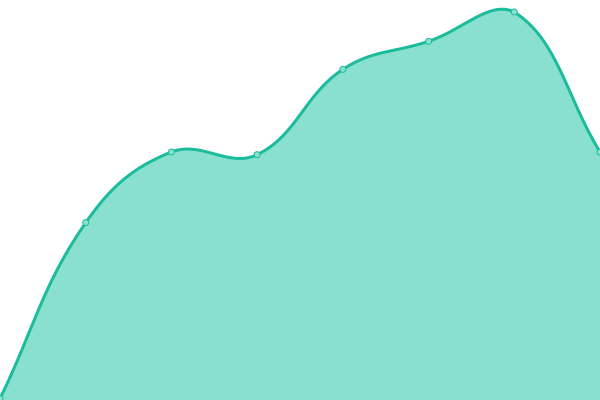 252ms
     
 | 

<a href="https://chaotic-art.github.io/uptime/history/nft-storage-ipos">100.00%</a>
    

|  [Speck GraphQL](https://chaotic.squids.live/speck@v16/api/graphql) | 🟩 Up | [speck-graph-ql.yml](https://github.com/chaotic-art/uptime/commits/HEAD/history/speck-graph-ql.yml) | 

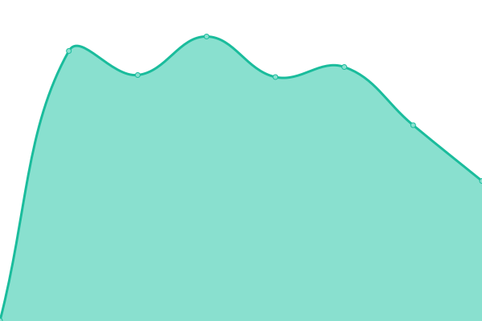 697ms
     
 | 

<a href="https://chaotic-art.github.io/uptime/history/speck-graph-ql">100.00%</a>
    

|  [Stick GraphQL](https://chaotic.squids.live/stick@v14/api/graphql) | 🟩 Up | [stick-graph-ql.yml](https://github.com/chaotic-art/uptime/commits/HEAD/history/stick-graph-ql.yml) | 

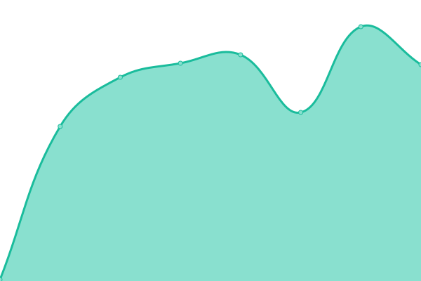 165ms
     
 | 

<a href="https://chaotic-art.github.io/uptime/history/stick-graph-ql">100.00%</a>
    

|  [Stellate AHK](https://chaotic-ahk.stellate.sh/) | 🟩 Up | [stellate-ahk.yml](https://github.com/chaotic-art/uptime/commits/HEAD/history/stellate-ahk.yml) | 

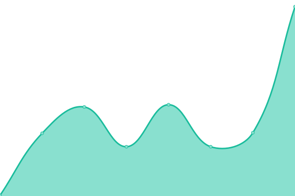 229ms
     
 | 

<a href="https://chaotic-art.github.io/uptime/history/stellate-ahk">100.00%</a>
    

|  [Stellate AHP](https://chaotic-ahp.stellate.sh/) | 🟩 Up | [stellate-ahp.yml](https://github.com/chaotic-art/uptime/commits/HEAD/history/stellate-ahp.yml) | 

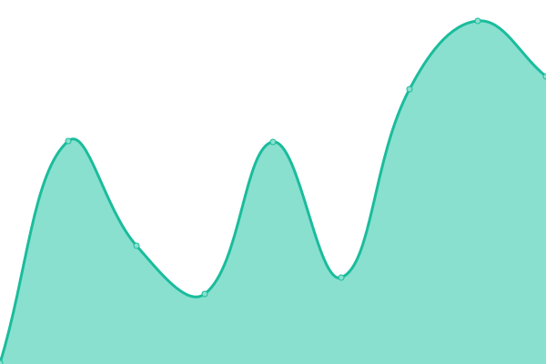 248ms
     
 | 

<a href="https://chaotic-art.github.io/uptime/history/stellate-ahp">100.00%</a>
    

|  [Speck GraphQL (POST)](https://chaotic.squids.live/speck@v16/api/graphql) | 🟩 Up | [speck-graph-ql-post.yml](https://github.com/chaotic-art/uptime/commits/HEAD/history/speck-graph-ql-post.yml) | 

 129ms
     
 | 

<a href="https://chaotic-art.github.io/uptime/history/speck-graph-ql-post">100.00%</a>
    

|  [Stick GraphQL (POST)](https://chaotic.squids.live/stick@v14/api/graphql) | 🟩 Up | [stick-graph-ql-post.yml](https://github.com/chaotic-art/uptime/commits/HEAD/history/stick-graph-ql-post.yml) | 

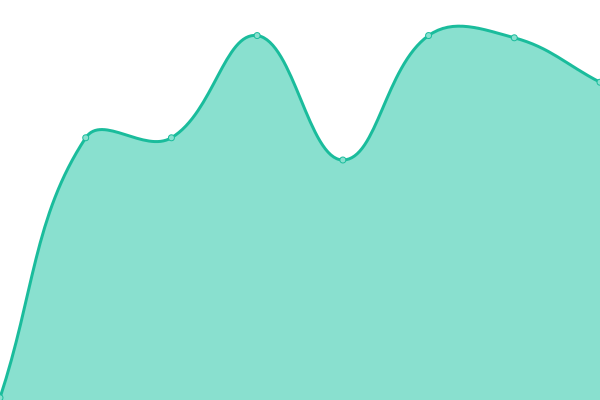 130ms
     
 | 

<a href="https://chaotic-art.github.io/uptime/history/stick-graph-ql-post">100.00%</a>
    

|  [Stellate AHK (POST)](https://chaotic-ahk.stellate.sh/) | 🟩 Up | [stellate-ahk-post.yml](https://github.com/chaotic-art/uptime/commits/HEAD/history/stellate-ahk-post.yml) | 

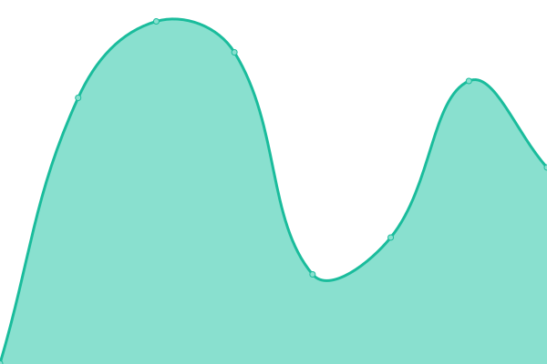 515ms
     
 | 

<a href="https://chaotic-art.github.io/uptime/history/stellate-ahk-post">100.00%</a>
    

|  [Stellate AHP (POST)](https://chaotic-ahp.stellate.sh/) | 🟩 Up | [stellate-ahp-post.yml](https://github.com/chaotic-art/uptime/commits/HEAD/history/stellate-ahp-post.yml) | 

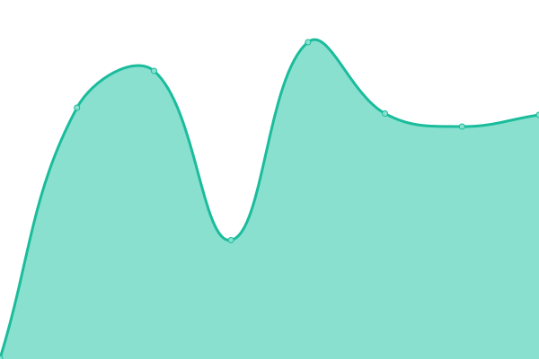 541ms
     
 | 

<a href="https://chaotic-art.github.io/uptime/history/stellate-ahp-post">100.00%</a>
    

<!--end: status pages-->

[**Visit our status website →**](https://chaotic-art.github.io/uptime)

## 📄 License

- Powered by: [Upptime](https://github.com/upptime/upptime)
- Code: [MIT](./LICENSE) © [Anand Chowdhary](https://anandchowdhary.com), supported by [Pabio](https://pabio.com)
- Data in the `./history` directory: [Open Database License](https://opendatacommons.org/licenses/odbl/1-0/)
